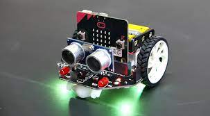

# ¿Qué es STEAM? 
- El término STEAM surge de las siglas en inglés de:  Science, Technology, Engineering, Arts & Mathematic
# ¿Qué es un robot maqueen?
- Su nombre es Maqueen y es un robot de programación gráfica para educación STEM diseñado para BBC micro: bit. Su chasis es plug and play y permite a los niños aprender rápidamente programación gráfica para entretener y fomentar el interés de los niños en la ciencia y el pensamiento lógico.

# Foto

