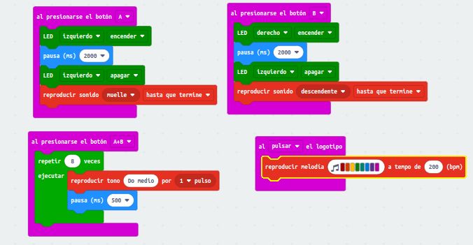
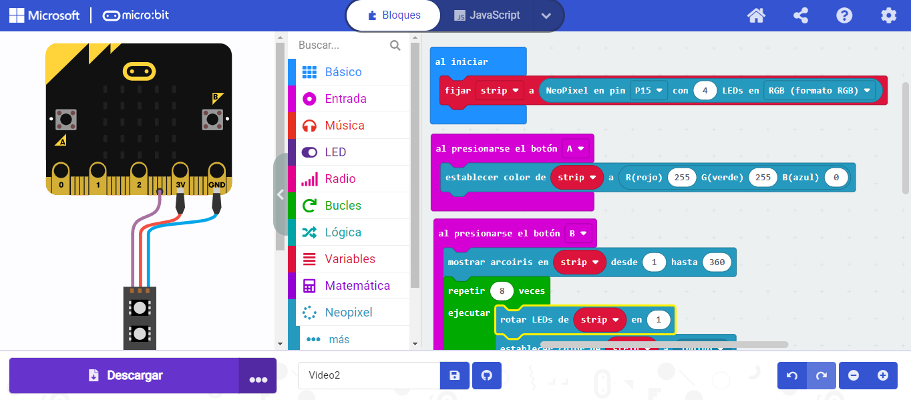
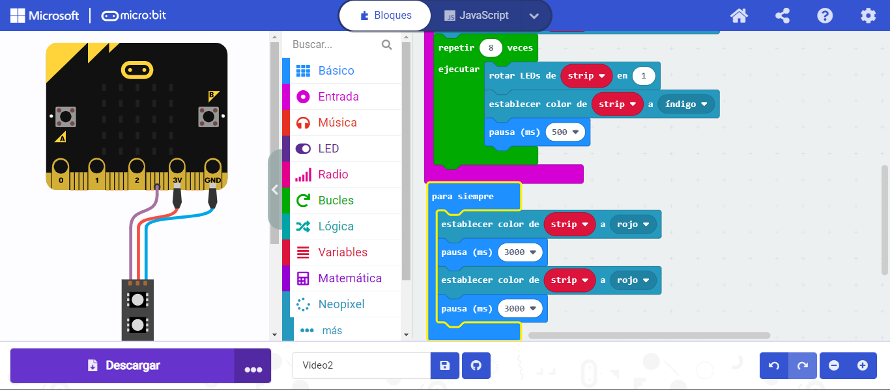
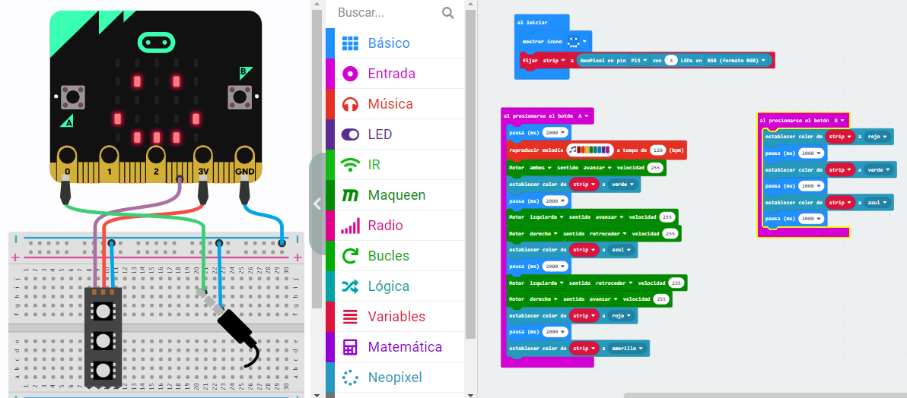

# Programación básica  1 
# Ejercicio 1
- Primeros pasos del robot:

  Al presionar A: encenderá la luz izquierda y reproducirá un sonido.
 
  Al presionar B: encenderá la luz derecha y reproducirá otro sonido.
 
  Al presionar A+B: encenderá ambas luces y reproducirá un sonido.
 
  Al presionar el logo: solo reproducirá un sonido

 
 
 
 ## Video de Explicacion
 - [Explicacion](https://www.youtube.com/watch?v=oUtcqfuMcIA)
 
 ## Video Funcionando 
 - [Video](https://www.youtube.com/shorts/rilxOZsHmJ4)

 ## Enlace al Codigo
 - [Codigo](maqueen2.hex)

 # Ejercicio 2
 
 ## Explicacion

 ## Video Funcionando 
  - [Video]
 
 ## Enlace al Codigo
 - [Codigo](modulo2ejercicio2.hex)

 # Ejercicio 3
 
 ## Video de Explicacion

 ## Video Funcionando 
 - [Video]
 
 ## Enlace al Codigo
 - [Codigo](modulo2ejercicio3.hex)

