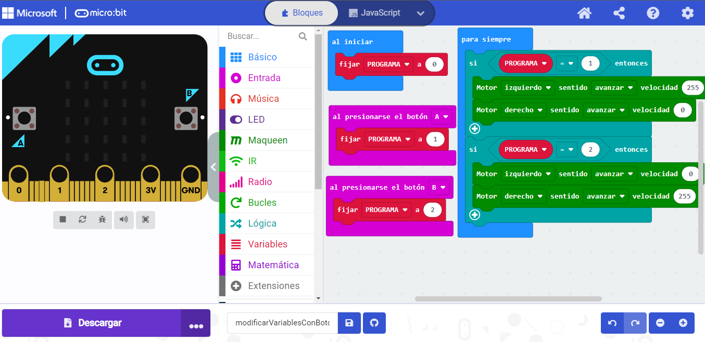
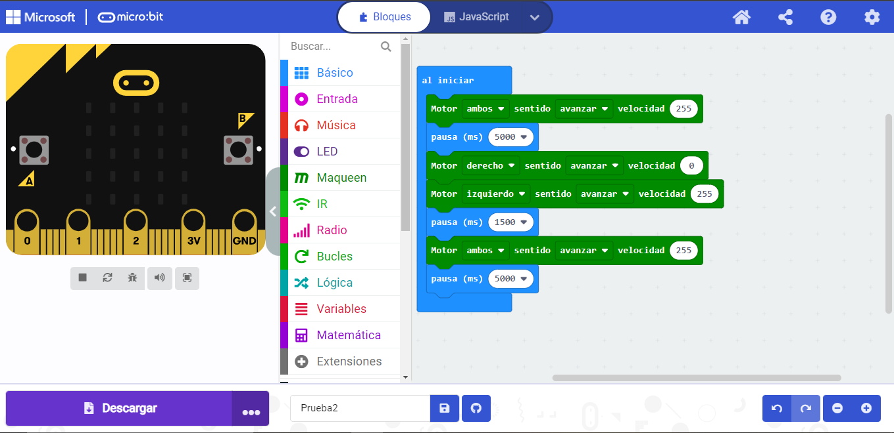

# Programación Básica 2

# Video 3: Variables y bucles de control

## Almacenar variables, los datos y sensores

 ## Explicacion
 El robot dependiendo del boton que se pulse realizará diferentes ordenes, mediante el uso de una varible.
 

 ## Video Funcionando 
  - [Video](https://youtu.be/KVbMr8pE_d4)
 
 ## Enlace al Codigo
 - [Codigo](modificarVariablesConBotones.hex)
 

#Actividad

 ## Explicacion
 El robot debe avanzar en linea recta 5 segundos. A continuancion, hacer un giro de 180º y volver hacia atras otros 5 segundos.
 

 ## Video Funcionando 
  - [Video](https://youtu.be/LaqXRHZGp-0)
 
 ## Enlace al Codigo
 - [Codigo](giro.hex)

