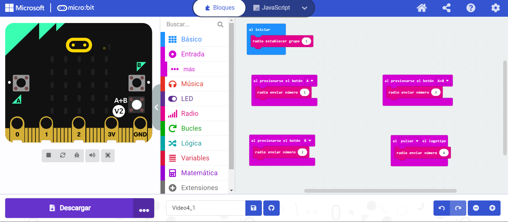
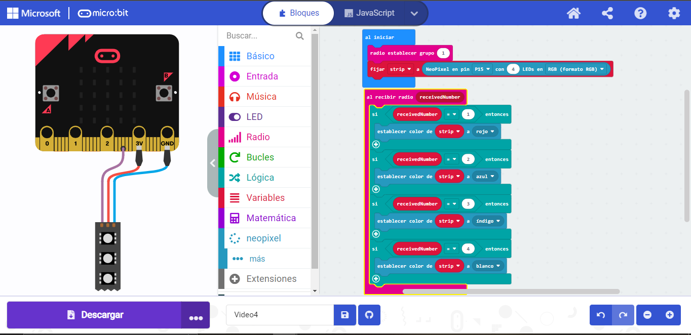

# Ampliación
# Ejercicio 1
- Para esta tarea es necesario 2 robot microbits, al igual que 2 codigos.
  El primer robot:
  Al presionar los diferentes botones de la placa microbit se realizaran diferentes acciones.

  El segundo robot:
  Reaccionará a las ordenes recibidas desde la tarjeta microbit emisora
  
 
 
  ## Video Funcionando
  
   - [Video](https://youtube.com/shorts/gsOA88AacUk?feature=share)

## Enlace al Codigo

- [Codigo 1](microbit-Video4_1.hex)

- [Codigo 2](modulo4ejercicio1_2.hex)
  
