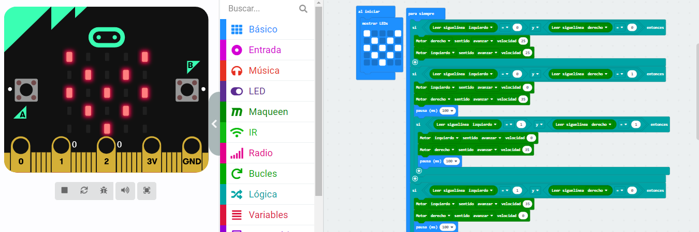
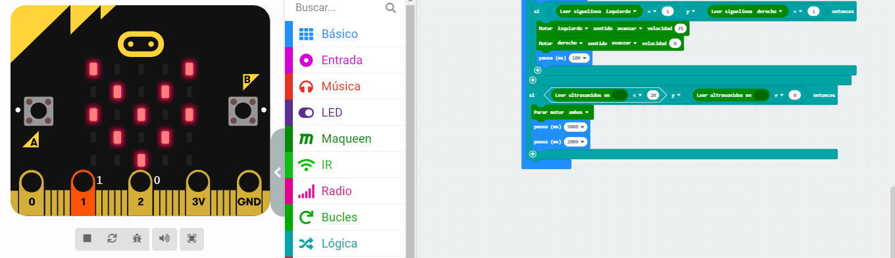

# Proyecto
# Ejercicio 1
El robot Maqueen esta programado para seguir la linea y en el momento que se le coloca un objeto o pared delante, lo detectará y se parará hasta que el obstaculo no esté presente.

## Video
   - [Video explicativo]()

## Enlace al Codigo

- [Codigo](microbitProyecto.hex)
